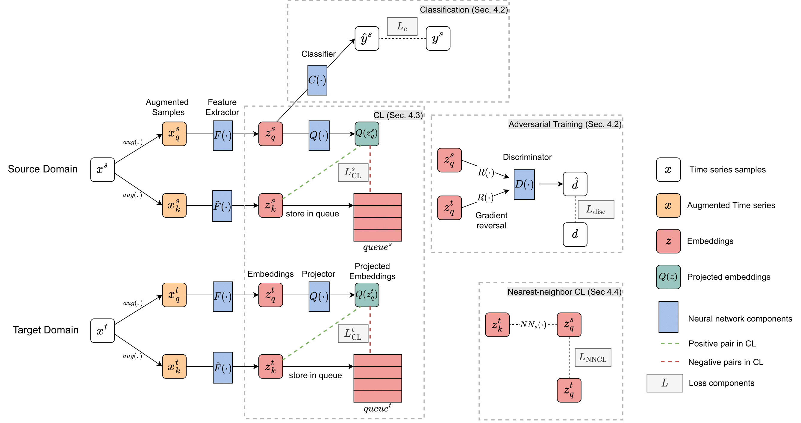

# CLUDA: Contrastive Learning for Unsupervised Domain Adaptation of Time Series (ICLR 2023)



The original implementation of the paper. You can cite the paper as below. 

```
@article{ozyurt2023contrastive,
  title={Contrastive Learning for Unsupervised Domain Adaptation of Time Series},
  author={Ozyurt, Yilmazcan and Feuerriegel, Stefan and Zhang, Ce},
  journal={ICLR},
  year={2023}
}
```

### Loading and Preparing Benchmark Datasets
First, create a folder and download the pre-processed versions of the datasets [WISDM](https://researchdata.ntu.edu.sg/dataset.xhtml?persistentId=doi:10.21979/N9/KJWE5B), [HAR](https://researchdata.ntu.edu.sg/dataset.xhtml?persistentId=doi:10.21979/N9/0SYHTZ), and [HHAR](https://researchdata.ntu.edu.sg/dataset.xhtml?persistentId=doi:10.21979/N9/OWDFXO). 

In the same folder, you need to run [train_val_test_benchmark.ipynb](train_val_test_benchmark.ipynb) to create valid train-val-test splits (the downloaded datasets initially have only train-test splits). Further, this script will convert the datasets into desired format. This script will create the new versions of the datasets in *./processed_datasets* folder (path relative to the folder in which you initially downloaded the datasets).

### Accessing ICU Datasets MIMIC-IV and AmsterdamUMCdb
If you want to do experiments on MIMIC-IV and AmsterdamUMCdb, first you need to get permission for these datasets even though it is publicly available. 

MIMIC-IV: Access details can be found [here](https://physionet.org/content/mimiciv/0.4/). 

AmsterdamUCMdb: Access details can be found [here](https://amsterdammedicaldatascience.nl).

### Loading ICU Datasets

Once you have access the ICU dataset(s), you can load them with R. For this, you can follow the steps at [load_ICU_datasets](./load_ICU_datasets).

### Preparing ICU Datasets

This step converts the output from previous step into np.array format to be used in Python. For this, you can follow the steps at [prepare_ICU_datasets](./prepare_ICU_datasets).

### Baselines

We compare our algorithm against the following baselines: [VRADA](https://openreview.net/pdf?id=rk9eAFcxg), [CoDATS](https://dl.acm.org/doi/pdf/10.1145/3394486.3403228), [AdvSKM](https://www.ijcai.org/proceedings/2021/0378.pdf), [CAN](https://openaccess.thecvf.com/content_CVPR_2019/papers/Kang_Contrastive_Adaptation_Network_for_Unsupervised_Domain_Adaptation_CVPR_2019_paper.pdf), [CDAN](https://proceedings.neurips.cc/paper/2018/file/ab88b15733f543179858600245108dd8-Paper.pdf), [DDC](https://arxiv.org/pdf/1412.3474.pdf), [DeepCORAL](https://link.springer.com/chapter/10.1007/978-3-319-49409-8_35), [DSAN](https://ieeexplore.ieee.org/document/9085896), [HoMM](https://ojs.aaai.org/index.php/AAAI/article/view/5745), and [MMDA](https://arxiv.org/pdf/1901.00282.pdf). 

The implementation of the baselines is adopted from the original papers, and from [AdaTime](https://github.com/emadeldeen24/AdaTime) benchmark suite for time series domain adaptation. 

### CLUDA

We used Python 3.6.5 in our experiments. 

You can install the requirement libraries via `pip install -r requirements.txt` into your new virtual Python environment.

Our main model architecture can be found [here](main/models/cluda.py). 

In [main](main), you can find all the scripts to train and evaluate our model. Further, you can find the script for getting the embeddings for your downstream tasks.

For instance, you can train our model with the default arguments as (assuming that you prepared the datasets as in earlier step.)

`python train.py --algo_name cluda --task decompensation --path_src ../Data/miiv_fullstays --path_trg ../Data/aumc_fullstays --experiments_main_folder UDA_decompensation --experiment_folder default` 

All the helper functions/classes are in [utils](utils). If you want to do some changes in dataset format, you can find it useful to check our [ICUDataset](utils/dataset.py) class or [SensorDataset](utils/dataset.py) class.

#### List of arguments

Below, we describe each argument used in the training script. Please note that the number of arguments is large because all the experimental setup is controlled here. In other words, with the arguments provided below, the user can freely experiment with both sensor and healthcare datasets and also with any other UDA algorithm or our novel CLUDA. We opted this design, so that the user doesn't need to go over any other scripts/documents other than this one, for his/her own unique experimental setup.

Note: If an argument is not used for a given algorithm (i.e., it is valid only for other methods), its value has no effect on the training. 

| Argument | Description |
| --- | --- |
| algo_name | Name of the UDA algorithm. See [algorithms](main/algorithms.py) for available options |
| num_channels_TCN | (If UDA method supports TCN) Number of channels at each layer. (e.g. "32-32-32" for 32 channels with 3 layers) |
| kernel_size_TCN | (If UDA method supports TCN) Kernel size of TCN |
| dilation_factor_TCN | (If UDA method supports TCN) Dilation factor of TCN |
| stride_TCN | (If UDA method supports TCN) Stride factor of TCN |
| momentum | Rate of momentum update applied to feature extractor in MoCo. (specific to CLUDA) |
| queue_size | Queue size of both domains in MoCo. (specific to CLUDA) |
| dropout | Rate of dropout to be applied at neural network layers |
| use_batch_norm | (If opted) batch normalization applied between neural network layers |
| use_mask | (If opted) For each channel of time series, another channel added for mask with 1s and 0s. (it doubles num channels of input) |
| weight_ratio | (Only for binary classification) In classification loss, minority class has weight_ratio X weights compared to majority class. Suggested to start with the rate of class imbalance, i.e. weight_ratio=9 if minority class is 10% of data. The weights are normalized such that sum of weights for N samples is again N (i.e., same as if no weight_ratio is applied). Therefore, user doesn't need to change learning_rate further|
| batch_size | Batch size for training |
| eval_batch_size | Batch size for evaluation at each checkpoint. Therefore, user can still train with small batch sizes (if it performs better) and use larger eval_batch_size for faster evaluation |
| num_val_iteration | Number of evaluation steps for validation set. Especially useful when the entire validation set is large and a small subset is sufficient for evaluation. Eventually, performance on val. set is calculated based on eval_batch_size*num_val_iteration samples. |
| num_epochs | Number of epochs for training (also read num_steps) |
| num_steps | Total number of steps for training. If num_steps < num_epochs * num_batches, the training is terminated based on num_steps |
| checkpoint_freq | Model is evaluated at each checkpoint_freq steps, and saved if it performs better |
| learning_rate | Learning rate of UDA training |
| weight_decay | Weight decay of UDA training  |
| n_layers | (VRADA only) Number of layers of VRNN |
| h_dim | (VRADA only) Hidden dimensions of VRNN |
| z_dim | (VRADA only) Latent state dimensions of VRNN |
| weight_domain | (available for UDA baselines) Weight of adversarial or metric-based domain adaptation loss of the given UDA algorithm|
| weight_KLD | (VRADA only) Weight of KL divergence loss|
| weight_NLL | (VRADA only) Weight of negative log-likelihood loss|
| weight_cent_target | (CDAN only) Weight of conditional entropy loss on target domain |
| weight_loss_src | (CLUDA only) Weight of contrastive learning loss on source domain |
| weight_loss_trg | (CLUDA only) Weight of contrastive learning loss on target domain |
| weight_loss_ts | (CLUDA only) Weight of nearest-neighbor contrastive learning loss across source and domains |
| weight_loss_disc | (CLUDA only) Weight of adversarial domain discriminator loss |
| weight_loss_pred | Weight of predictions loss. It is defaulted to 1, only provided for flexibility |
| experiments_main_folder | Path to the main experiment folder. It will be created if it doesn't exist |
| experiment_folder | The child folder of experiments_main_folder. It will be created under experiments_main_folder if it doesn't exist |
| path_src | Root directory of source domain dataset. For instance, "miiv_fullstays" for healthcare or "WISDM" for sensor datasets|
| path_trg | Root directory of target domain dataset. For instance, "miiv_fullstays" for healthcare or "WISDM" for sensor datasets|
| age_src | (For healthcare dataset) Age group of the source domain. If you input -1, the model will use all age groups together. |
| age_trg | (For healthcare dataset) Age group of the target domain. If you input -1, the model will use all age groups together. |
| id_src | (For sensor dataset) ID of the subject for the source domain |
| id_trg | (For sensor dataset) ID of the subject for the target domain |
| task | (For healthcare dataset) The task to perform. Choose from {"mortality", "decompensation", "los"} (los: length of stay) |
| log | File to log training progress |
| seed | Random seed. With a fixed seed, the code should yield the same result for the same computing node. (useful for debug and controlled random instantiations) |


### Running Examples on Sensor Datasets

To facilitate a straight-forward usage for the user, here we provide the concrete examples of how to run our CLUDA on sensor datasets. Below configurations will provide similar results presented in our paper. These configurations don't require high computational resources, ~4GB GPU memory should be sufficient. 

**Note**: As pre-requisite, you need to download the sensor datasets and run [train_val_test_benchmark.ipynb](train_val_test_benchmark.ipynb) before.

**Note**: Don't forget to manually fill <path/to/Dataset>, <ID_src>, and <ID_trg> fields according to your own setup.

#### Training on WISDM

`python train.py --algo_name cluda --queue_size 8192 --momentum 0.99 --batch_size 32 --eval_batch_size 1024 --num_epochs 10000 --num_steps 10000  --weight_loss_disc 1  --weight_loss_src 0.1 --weight_loss_trg 0.1 --weight_loss_ts 0.2 --learning_rate 1e-4 --dropout 0.2 --weight_decay 1e-4 --num_channels_TCN 32-32-32-32-32-32 --dilation_factor_TCN 2 -—kernel_size_TCN 3 --hidden_dim_MLP 128 --path_src <path/to/WISDM> --id_src <ID_src> --path_trg <path/to/WISDM> --id_trg <ID_trg> --experiments_main_folder experiment_WISDM_<ID_src>_<ID_trg> --experiment_folder default`


#### Training on HAR

`python train.py --algo_name cluda --queue_size 8192 --momentum 0.99 --batch_size 32 --eval_batch_size 1024 --num_epochs 10000 --num_steps 10000  --weight_loss_disc 1  --weight_loss_src 0.05 --weight_loss_trg 0.05 --weight_loss_ts 0.1 --learning_rate 1e-4 --dropout 0.2 --weight_decay 1e-4 --num_channels_TCN 64-64-64 --dilation_factor_TCN 3 -—kernel_size_TCN 7 --hidden_dim_MLP 128 --path_src <path/to/HAR> --id_src <ID_src> --path_trg <path/to/HAR> --id_trg <ID_trg> --experiments_main_folder experiment_HAR_<ID_src>_<ID_trg> --experiment_folder default`

#### Training on HHAR

`python train.py --algo_name cluda --queue_size 8192 --momentum 0.99 --batch_size 32 --eval_batch_size 1024 --num_epochs 10000 --num_steps 10000  --weight_loss_disc 1  --weight_loss_src 0.05 --weight_loss_trg 0.05 --weight_loss_ts 0.1 --learning_rate 1e-4 --dropout 0 --weight_decay 1e-4 --num_channels_TCN 64-64-64 --dilation_factor_TCN 3 -—kernel_size_TCN 7 --hidden_dim_MLP 128 --path_src <path/to/HHAR> --id_src <ID_src> --path_trg <path/to/HHAR> --id_trg <ID_trg> --experiments_main_folder experiment_HHAR_<ID_src>_<ID_trg> --experiment_folder default`

#### Training with other UDA algorithms

In case you want to test/compare other UDA algorithms, you can follow these steps: Change the algo_name with your preferred UDA algorithm. Keep TCN related arguments fixed (for a fair comparison among UDA methods), only exception is VRADA, which needs to be tuned separately. Add weight_loss arguments of the corresponding UDA algorithm (see our detailed table of arguments, and Appendix of our paper). To further improve the results, now you can tune other parameters.  

#### Evaluation

Once the training is completed, you only need to provide <experiments_main_folder> and <experiment_folder>. The rest will be retrieved from the saved arguments and the saved model. 

`python eval.py --experiments_main_folder <experiments_main_folder> --experiment_folder <experiment_folder>`

### Running Examples on Healthcare Datasets

Here we further provide a concrete example of how to run our CLUDA on healthcare datasets, such as MIMIC-IV and AmsterdamUMCdb. Below configuration should provide a decent start in prediction performance, which could be enhanced by further hyper-parameter tuning. Different from sensor datasets, these healtchare datasets are large, and hence, may require larger batches,longer training time and higher GPU memory (~10 GB). 

**Note**: As pre-requisite, you need to download the healthcare datasets and pre-process as explained in our repo.

**Note**: Don't forget to manually fill <path/to/Dataset>, <task>, <age_src>, and <age_trg> fields according to your own setup. If you want to use all age groups, you can use -1 for <age_src> and/or <age_trg>.

`python train.py --algo_name cluda --queue_size 49152 --momentum 0.99 --batch_size 2048 --eval_batch_size 2048 --num_epochs 10000 --num_steps 10000  --weight_loss_disc 1  --weight_loss_src 0.05 --weight_loss_trg 0.05 --weight_loss_ts 0.2 --learning_rate 2e-5 --dropout 0.0 --weight_decay 1e-4 --num_channels_TCN 64-64-64-64-64 --dilation_factor_TCN 2 --kernel_size_TCN 3 --hidden_dim_MLP 256 --use_mask --path_src <path/to/Dataset_src> --age_src <age_src> --path_trg <path/to/Dataset_trg> --id_trg <age_trg> --task <task> --experiments_main_folder experiment_<Dataset_src>_<age_src>_<Dataset_trg>_<age_trg> --experiment_folder default`

For training with other UDA methods and evaluation, you can use the same strategy as in above subsection. 
